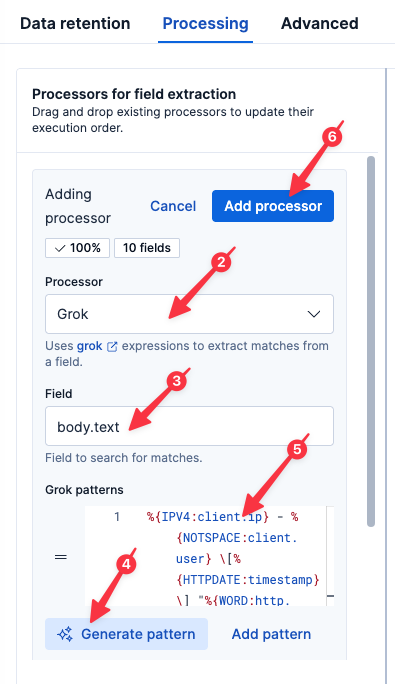
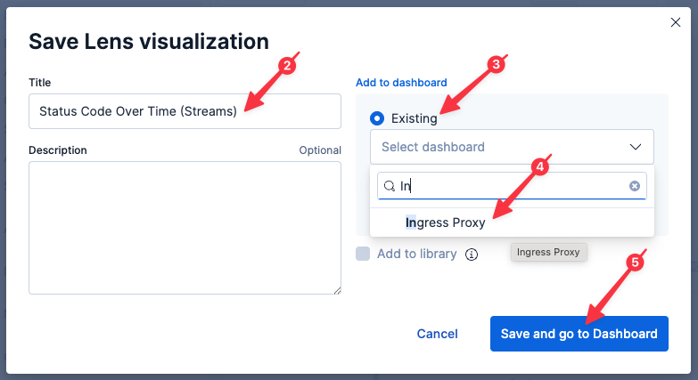
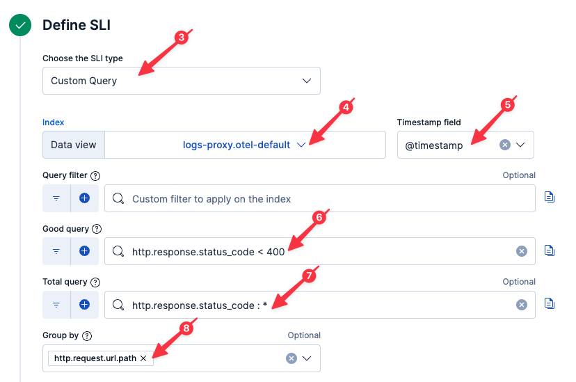

So far, we've been using ES|QL to parse our proxy logs at query-time. While incredibly powerful for quick analysis, we can do even more with our logs if we parse them at ingest-time.

# Parsing with Streams

We will be working with Elastic [Streams](https://www.elastic.co/docs/solutions/observability/logs/streams/streams) which makes it easy to setup log parsing pipelines.

1. Select `logs-proxy.otel-default` from the list of data streams (if you start typing, Elasticsearch will help you find it)
2. Select the `Processing` tab


## Parsing the log message

We can parse our nginx log messages at ingest-time using the Elastic [Grok](https://www.elastic.co/docs/reference/enrich-processor/grok-processor) processor.

1. Select `Create processor` from the menu `Create your first step`


2. Select the `Grok` Processor (if not already selected)
3. Set the `Field` to
  ```
  body.text
  ```
4. Click `Generate pattern`. Elasticsearch will analyze your log lines and try to determine a suitable grok pattern.
5. To ensure a consistent lab experience, copy the following grok expression and paste it into the `Grok patterns` field (_do not_ click the `Accept` button next to the generated pattern)
```
%{IPV4:attributes.client.ip}\s-\s-\s\[%{HTTPDATE:attributes.custom.timestamp}\]\s"%{WORD:attributes.http.request.method_original} /(?<attributes.url.path>%{WORD}/%{WORD}) (?<attributes.http.version>%{WORD}/%{INT}\.%{INT})"\s%{INT:attributes.http.response.status_code}\s%{INT:attributes.http.response.body.size}\s"-"\s"%{DATA:resource.attributes.user_agent.original}"\s
```
6. Wait until the sample `body.text` on the right shows highlighting, then click `Create`

> [!NOTE]
> You may receive an error indicating `attributes.custom.timestamp` is malformed. This is expected and will be addressed in the next step which conforms the timestamp to Elasticsearch's format.



## Parsing the timestamp

The nginx log line includes a timestamp; let's use that as our record timestamp.

1. Select `Create processor` from the menu `Create`
2. Select the `Date` Processor
3. Set `Field` to `attributes.custom.timestamp`
4. Elastic should auto-recognize the format: `dd/MMM/yyyy:HH:mm:ss XX`
5. Click `Create`


Finally, now that we've promoted our log timestamp to be that of the record timestamp, we can delete `attributes.custom.timestamp` to save disk space:

1. Select `Create processor` from the menu `Create`
2. Select the `Remove` Processor
3. Set `Source Field` to `attributes.custom.timestamp`
4. Click `Create`


> [!NOTE]
> `attributes.custom.timestamp` won't be available in the dropdown of available fields, but you can still enter the value.

## Saving our processors

Now let's save our Processing chain.

1. Click `Save changes` in the bottom-right
2. Click `Confirm changes` in the resulting dialog


# A faster way to query

Now let's jump back to Discover by clicking `Discover` in the left-hand navigation pane.

Execute the following query:
```esql
FROM logs-proxy.otel-default
| WHERE http.response.status_code IS NOT NULL
| KEEP @timestamp, attributes.client.ip, attributes.http.request.method_original, attributes.url.path, attributes.http.response.status_code, resource.attributes.user_agent.original
```

> [!NOTE]
> If you get back `1,000 results` but the resulting columns are empty, remove the `Selected fields` (by clicking the `X` next to each), and then add each `Available field` (by clicking the `+` next to each).

Let's redraw our status code graph using our newly parsed field:

Execute the following query:
```esql
FROM logs-proxy.otel-default
| WHERE attributes.http.response.status_code IS NOT NULL
| STATS COUNT() BY TO_STRING(attributes.http.response.status_code), minute = BUCKET(@timestamp, "1 min")
```

Note that this graph, unlike the one we drew before, currently shows only a few minutes of data. That is because it relies upon the fields we parsed in the Processing we just setup. Prior to that time, those fields didn't exist. Change the time field to `Last 5 Minutes` to zoom in on the newly parsed data.

## Saving our visualization to a dashboard

This is a useful graph! Let's save it to our dashboard for future use.

1. Click on the Disk icon in the upper-right of the resulting graph
2. Name the visualization
  ```
  Status Code Over Time
  ```
3. Select `New` under `Add to dashboard`
4. Click `Save and go to Dashboard`



You will be taken to a new dashboard. Let's save it for future reference.

1. Click the `Save` button in the upper-right
2. Enter the title of the new dashboard as
  ```
  Ingress Status
  ```
3. Click `Save`

# Creating a SLO

> [!NOTE]
> Because we are moving quickly, Elasticsearch may take some time to update field lists in the UI. If you encounter a situation where Elasticsearch doesn't recognize one of the fields we just parsed, click the Refresh icon in the upper-right of the Instruqt tab and try again to create the SLO.


Now that we are parsing out specific fields at ingest-time, we can create a SLO to monitor HTTP status over time. With a SLO, we can allow for some percentage of errors over time (common in a complex system) before we get our support staff out of bed.

1. Click `SLOs` in the left-hand navigation pane
2. Click `Create SLO`
3. Select `Custom Query` (if not already selected)
4. Set `Data view` to `logs-proxy.otel-default`
5. Set `Timestamp field` to `@timestamp` (if not already selected)
6. Set `Good query` to
  ```
  attributes.http.response.status_code < 400
  ```
7. Set `Total query` to
  ```
  attributes.http.response.status_code : *
  ```
8. Set `Group by` to
  ```
  attributes.url.path
  ```



9. Set `SLO Name` to
  ```
  Ingress Status
  ```
10. Set `Tags` to
  ```
  ingress
  ```
11. Click `Create SLO`


## Alerting on a SLO

Now let's setup an alert that triggers when this SLO is breached.

1. Click on your newly created SLO `Ingress Status`
2. Under the `Actions` menu in the upper-right, select `Manage burn rate rule`

With burn rates, we can have Elastic dynamically adjust the escalation of a potential issue depending on how quickly it appears we will breach our SLO.

3. Click on the `Actions` tab of the fly-out
4. Click `Add action`
5. Select `Cases` (this will automatically open a case/ticket when this SLO is breached)


6. Click on the `Details` tab of the fly-out
7. Set the `Rule name` to :
  ```
  Ingress Status SLO
  ```
8. Set `Tags` to
  ```
  ingress
  ```
9. Click `Save changes`


We now have a SLO that will tolerate a configurable percentage of errors, governed by a contractual goal. When it looks like we may violate that SLO, an alert will fire, which in turn will automatically open a case in Elastic! Moreover, if configured, Elastic can synchronize cases with your [existing ticket management systems](https://www.elastic.co/docs/reference/kibana/connectors-kibana).

## Adding SLO monitors to our dashboard

Now let's add the SLO monitor to our dashboard to help us find it in the future.

1. Click `Dashboards` in the left-hand navigation pane
2. Open the `Ingress Status` dashboard (if not already open)
3. Click the `Add` button in the upper-right
4. Select `New panel` from the dropdown menu
5. Select `SLO Overview`
6. Select `Grouped SLOs`
7. Set `Group by` to `Tags`
8. Set `Tags` to `ingress`
9. Click `Save`


Note that we are dynamically adding SLOs by tag. Any additional SLOs tagged with `ingress` will also appear here.

## Adding alerts to our dashboard

Let's also add our growing list of alerts to our dashboard.

1. Click the `Add` button in the upper-right
2. Select `New panel` from the dropdown menu
3. Select `Alerts`
4. Set `Solution` to `Observability`
5. Set `Filter by` to `Rule tags`
6. Set `Rule tags` to `ingress`
7. Click `Save`

Note that we are dynamically adding alerts by tag. Any additional alerts tagged with `ingress` will also appear here.

Now save the changes to our dashboard by clicking the `Save` button in the upper-right.

## Organizing our dashboard

As we are adding panels to our dashboard, we can group them into collapsible sections.

1. Click the `Add` button in the upper-right
2. Select `Collapsible Section` from the dropdown menu
3. Click on the Pencil icon to the right of the name of the new collapsible section
4. Name the collapsible section
  ```
  Alerts
  ```
5. Click the green check box next to the name of the collapsible section
6. Open the collapsible section (if it isn't already) by clicking on the open/close arrow to the left of the collapsible section name
7. Drag `SLO Overview` and the Alerts panel we just setup into the body below the `Alerts` collapsible section
8. Click `Save` to save the dashboard

# Summary

Let's take stock of what we know:

* a small percentage of requests are experiencing 500 errors
* the errors started occurring around 80 minutes ago
* the only error type seen is 500

And what we've done:

* Created several graphs to help quantify the extent of the problem
* Parsed the logs at ingest-time for quicker and more powerful analysis
* Created a dashboard to monitor our ingress proxy
* Create a SLO (with alert) to let us know if we ever return a significant number of non-200 error codes over time
