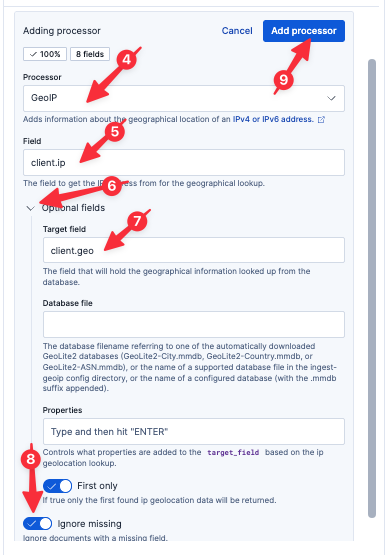

We still don't know why some requests are failing. Now that we are parsing the logs, however, we have access to a lot more information.

# Is this affecting every region?

Let's analyze our clients by `client.ip` to look for possibly geographic patterns.

## Adding the GeoIP processor

We can add the Elastic [GeoIP](https://www.elastic.co/docs/reference/enrich-processor/geoip-processor) processor to geo-locate our clients based on their client IP address.

1. Select `logs-proxy.otel-default` from the list of Streams.
2. Select the `Processing` tab
3. Select `Create processor` from the menu `Create`
4. Select the `Manual pipeline configuration` Processor
5. Set the `Ingest pipeline processors` field to:
  ```
  [
    {
      "geoip": {
        "field": "attributes.client.ip",
        "target_field": "client.geo",
        "ignore_missing": true
      }
    }
  ]
  ```
6. Click `Create`
7. Click `Save changes` in the bottom-right
8. Click `Confirm changes` in the resulting dialog



## Setting field mappings

Now we need to map several of our new fields to the proper field type.

1. Select the `Schema` tab
2. Search for field `client.geo.location`
3. Click on the ellipse on the right-hand side of the `client.geo.location.lat` row and select `Map as geo field`
4. Click `Stage changes` in the resulting dialog
5. Search for field `client.geo.country_iso_code`
6. Click on the ellipse on the right-hand side of the `client.geo.country_iso_code` row and select `Map field`
7. Set `Type` to `Keyword`
8. Click `Stage changes` in the resulting dialog
9. Click `Submit changes` in the bottom-right
10. Click `Confirm changes` in the resulting dialog

## Analyzing with Discover

Jump back to Discover by clicking `Discover` in the left-hand navigation pane.

Adjust the time field to show the last 3 hours of data.

Execute the following query:
```esql
FROM logs-proxy.otel-default
| WHERE client.geo.country_iso_code IS NOT NULL AND attributes.http.response.status_code IS NOT NULL
| STATS COUNT() BY attributes.http.response.status_code, client.geo.country_iso_code
| SORT attributes.http.response.status_code DESC
```

Let's make this a pie chart to allow for more intuitive visualization.

1. Click the pencil icon to the right of the graph
2. Select `Pie` from the dropdown menu
3. Click `Apply and close`

Wow! It looks like all of our 500 errors are occurring in the `TH` (Thailand) region. That is really interesting; without more information, we might be tempted to stop our RCA analysis here. However, there is often more to the story, as we will see.

### Saving our visualization to a dashboard

In the meantime, this is a useful graph! Let's save it to our dashboard for future use.

1. Click on the Disk icon in the upper-right of the resulting graph
2. Name the visualization
  ```
  Status by Region
  ```
3. Select `Existing` under `Add to dashboard`
4. Select the existing dashboard `Ingress Status` (you will need to start typing `Ingress` in the `Search dashboards...` field)
4. Click `Save and go to Dashboard`
5. Once the dashboard has loaded, click the `Save` button in the upper-right

## Visualizing with Maps

> [!NOTE]
> Because we are moving quickly, Elasticsearch may take some time to update field lists in the UI. If you encounter a situation where Elasticsearch doesn't recognize one of the fields we just parsed, click the Refresh icon in the upper-right of the Instruqt tab and try again to create the Map.

Sometimes it is helpful to visualize client geography on a map. Fortunately, Elastic has a built-in Map visualization we can readily use!

First, let's change the map projection from 3D to 2D:

1. Go to `Other tools` > `Maps` using the left-hand navigation pane
2. Click `Settings` in the upper-right
3. Under `Display`, set `Projection` to `Mercator`
4. Click `Keep changes` in the settings fly-out


Now let's visualize client access by location and status code:

1. Click `Add layer`
2. Click the `Elasticsearch` tab under `Add layer`
3. Select `Documents`
4. Select `Data view` to `logs-proxy.otel-default`
5. Set `Geospatial field` to `client.geo.location` (if this field isn't available, refresh the Instruqt virtual browser tab)
6. Click `Add and continue`
7. Scroll down to `Layer style`
8. Set `Fill color` to `By value`
9. Set `Select a field` to `http.response.status_code`
10. Select `Custom color ramp` in the field next to `As number`
11. Select a greenish color for the first number row (if not already selected)
12. Click the `+` button to the right of the first number row
13. Enter `400` in the second number row
14. Select a reddish color for the `400` number row
15. Set `Symbol Size` to `By value`
16. Set `Select a field` to `http.response.status_code`
17. Click `Keep changes`


Feel free to scroll around the globe and note the intuitive visualization of client locations and status codes.

### Saving our map to a dashboard

Let's add our map to our dashboard for future reference.

1. Click the `Save` button in the upper-right
2. Set `Title` to
  ```
  Status Code by Location
  ```
3. Select existing dashboard `Ingress Status` (you will need to start typing `Ingress` in the `Search dashboards...` field)
4. Click `Save and go to dashboard`

Now save the dashboard by clicking on the `Save` button in the upper-right.

# Summary

Let's take stock of what we know:

* a small percentage of requests are experiencing 500 errors
* the errors started occurring around 80 minutes ago
* the only error type seen is 500
* the errors occur over all APIs
* the errors occur only in the `TH` (Thailand) region

And what we've done:

* Created a dashboard to monitor our ingress proxy
* Created graphs to monitor status codes over time
* Created a simple alert to let us know if we ever return non-200 error codes
* Parsed the logs at ingest-time for quicker and more powerful analysis
* Create a SLO (with alert) to let us know if we ever return a significant number of non-200 error codes over time
* Created visualizations to help us visually locate clients and errors
