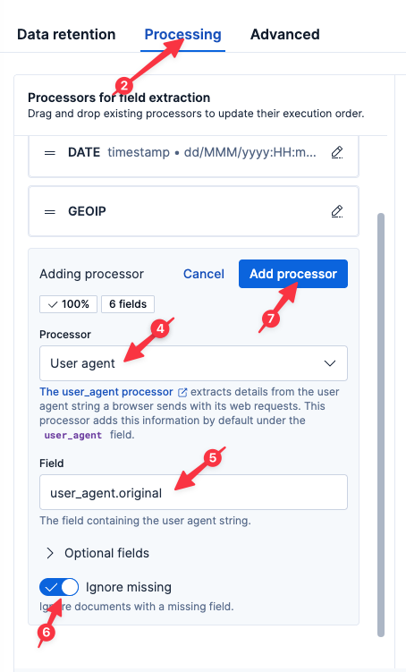

We know that errors appear to be localized to a specific region. But maybe there is more to the story?

# Is this affecting every type of browser?

Remember the User Agent string we tried to group by and failed using ES|QL? While nearly impossible to parse with a simple grok expression, we can easily parse the User Agent string using the Elastic [User agent](https://www.elastic.co/docs/reference/enrich-processor/user-agent-processor) processor.

## Adding the User Agent processor

1. Select `logs-proxy.otel-default` from the list of Streams.
2. Select the `Processing` tab
3. Select `Create processor` from the menu `Create`
4. Select the `Manual pipeline configuration` Processor
5. Set the `Ingest pipeline processors` field to:
  ```
  [
    {
      "user_agent": {
        "field": "resource.attributes.user_agent.original",
        "target_field": "user_agent",
        "extract_device_type": true,
        "ignore_missing": true
      }
    }
  ]
  ```
6. Click `Create`



## Setting field mappings

1. Click the `Modified fields` tab
2. Click the ellipse on the far right of the `user_agent.name` row
3. Select `Map field`
4. Set the type to `Keyword`
5. Click the ellipse on the far right of the `user_agent.version` row
6. Select `Map field`
7. Set the type to `Keyword`
8. Click the ellipse on the far right of the `user_agent.os.name` row
9. Select `Map field`
10. Set the type to `Keyword`
11. Click the ellipse on the far right of the `user_agent.os.version` row
12. Select `Map field`
13. Set the type to `Keyword`
14. Click `Stage changes`

## Saving our processors

Now let's save our Processing chain.

1. Click `Save changes` in the bottom-right
2. Click `Confirm changes` in the resulting dialog

## Analyzing with Discover

Now let's jump back to Discover by clicking `Discover` in the left-hand navigation pane.

Execute the following query:
```esql
FROM logs-proxy.otel-default
| EVAL user_agent.full = CONCAT(user_agent.name, " ", user_agent.version)
| WHERE user_agent.full IS NOT NULL
| STATS good = COUNT(http.response.status_code < 400 OR NULL), bad = COUNT(http.response.status_code >= 400 OR NULL) BY user_agent.full
| SORT bad DESC
```

Ah-ha, there is more to the story! It appears our errors may be isolated to a specific browser version. Let's break this down by `user_agent.version`.

```esql
FROM logs-proxy.otel-default
| WHERE user_agent.version IS NOT NULL
| STATS good = COUNT(http.response.status_code < 400 OR NULL), bad = COUNT(http.response.status_code >= 400 OR NULL) BY user_agent.version
| SORT bad DESC
```

Indeed, it appears we might have a problem with version 136 of the Chrome browser!

# Correlating with region

So what's the correlation with the geographic area we previously identified as being associated with the errors we saw?

Execute the following query:
```esql
FROM logs-proxy.otel-default
| WHERE client.geo.country_iso_code IS NOT NULL AND user_agent.version IS NOT NULL AND http.response.status_code IS NOT NULL
| EVAL version_major = SUBSTRING(user_agent.version,0,LOCATE(user_agent.version, ".")-1)
| WHERE user_agent.name LIKE "*Chrome*" AND TO_INT(version_major) == 136
| STATS COUNT() BY client.geo.country_iso_code
```

A-ha! It appears that this specific version of the Chrome browser (v136) has only been seen in the `TH` region! Quite possibly, Google has rolled out a specialized or canary version of their browser first in the `TH` region. That would explain why we saw errors only in the `TH` region.

Congratulations! We found our problem! In the next challenge, we will setup a way to catch new User Agents in the future.

# Summary

Let's take stock of what we know:

* a small percentage of requests are experiencing 500 errors
* the errors started occurring around 80 minutes ago
* the only error type seen is 500
* the errors occur over all APIs
* the errors occur only in the `TH` region
* the errors occur only with browsers based on Chrome v136

And what we've done:

* Created a dashboard to monitor our ingress proxy
* Created graphs to monitor status codes over time
* Created a simple alert to let us know if we ever return non-200 error codes
* Parsed the logs at ingest-time for quicker and more powerful analysis
* Create a SLO (with alert) to let us know if we ever return a significant number of non-200 error codes over time
* Created visualizations to help us visually locate clients and errors